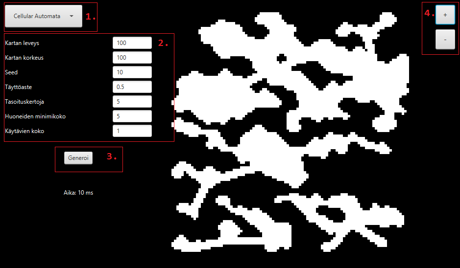

# Käyttöohje

Lataa sovelluksen uusin [release](https://github.com/ikaevalko/map-generator/releases). 

1. Käynnistä sovellus kaksoisklikkaamalla käynnistäjäskriptiä:
	- `launch-linux`, jos käytät Linuxia
	- `launch-win.bat, jos käytät Windowsia
	
Vaihtoehtoisesti voit käynnistää sovelluksen komentoriviltä ajamalla komennon 
`java -Xss128M -jar map-generator-all.jar` kansiossa _jar_.

### Karttojen generointi

1. Valitse alasvetovalikosta käytettävä algoritmi.
2. Määrittele valitsemallesi algoritmille parametrit syöttökenttiin. 
Parametrit on kuvailtu tarkemmin [toteutusdokumentissa](toteutusdokumentti.md).
3. Klikkaa "Generoi"-nappia. Jos parametrit ovat virheellisiä, yritä muuttaa niitä virheviestin ohjeistuksen mukaisesti. 
Mikäli parametrit ovat oikeellisia, niin kartta piirtyy näytölle hetken kuluttua.
4. Karttaa voi tarvittaessa suurentaa ja pienentää oikean yläkulman napeista.

