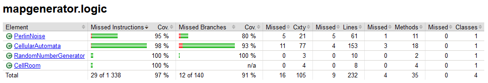
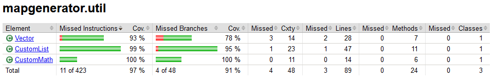
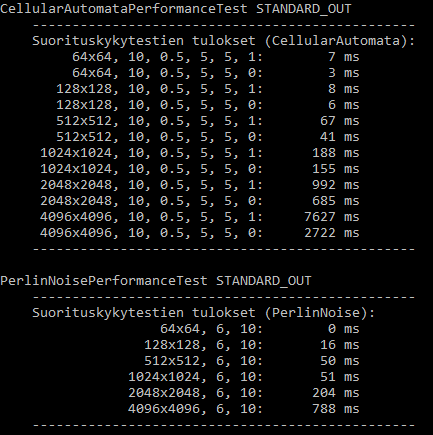

# Testaus

Ohjelmalle on määritelty sekä yksikkö- että suorituskykytestejä.

## Yksikkötestaus

Yksikkötestit suoritetaan komennolla

```
gradlew test
```

Testikattavuusraportti luodaan kansioon _build/reports/jacoco/test/html_ komennolla

```
gradlew jacocoTestReport
```

Käyttöliittymäkoodi ja pääohjelma on jätetty pois testauksen piiristä.




## Suorituskykytestaus

Suorituskykytestit suoritetaan komennolla
```
gradlew performanceTest
```

Algoritmien suorituskykyä testataan eri kokoparametreilla:
- 64 x 64
- 128 x 128
- 512 x 512
- 1024 x 1024
- 2048 x 2048
- 4096 x 4096

Muut parametrit on asetettu lähtökohtaisesti oletusarvoikseen. Ainoa poikkeus on CellularAutomatan käytävien koko, 
joka saa jokaista karttakokoa kohden arvot 1 (luo käytäviä) ja 0 (ei käytäviä). Tähän syynä on se, että käytävien 
lisäämisellä on havaittu olevan merkittävä vaikutus algoritmin tehokkuuteen suuremmilla karttako'oilla.

Parametrien oletusarvot on valittu niin, että niillä saadaan mahdollisimman tavanomainen generointiprosessi, joka 
myös tuottaa mielekkään kartan.

#### CellularAutomata - oletusparametit
- Seed: 10
- Täyttöaste: 0.5
- Tasoituskertoja: 5
- Huoneiden minimikoko: 5
- Käytävien koko: 1 tai 0

#### PerlinNoise - oletusparametrit
- Ristikon koko: 6
- Seed: 10

#### Suuntaa antavia testituloksia



Tuloksista voidaan nähdä, että koon kasvaessa PerlinNoise suoriutuu huomattavasti nopeammin kuin CellularAutomata. 
Tämä ei ole kovin yllättävää, sillä iteraatioiden määrä CellularAutomatan eri vaiheissa on moninkertainen verrattuna 
PerlinNoiseen.