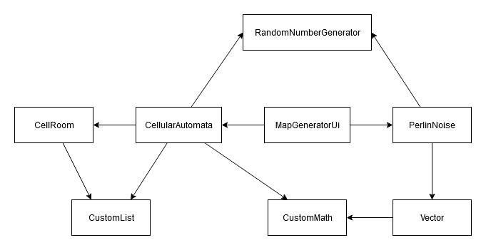

# Toteutus

### Luokkien väliset riippuvuudet

### CellularAutomata

Algoritmi tuottaa kaksiulotteisen totuusarvotaulukon, joka kuvaa generoitua karttaa. 
Taulukossa totuusarvo `true` tarkoittaa lattiaa ja `false` seinää. Kartan generointi 
tapahtuu vaiheittain seuraavasti:

1. Taulukko alustetaan satunnaisilla totuusarvoilla.

2. Muodostetaan soluautomaatiolla varsinaiset lattia-alueet eli huoneet.

3. Selvitetään erilliset huoneet rekursiivisella flood-fill -algoritmilla.

4. Poistetaan kaikki huoneet, jotka eivät täytä minimikoon ehtoa.

5. Yhdistellään huoneita toisiinsa Bresenhamin algoritmilla.

Algoritmille annettavat parametrit:

- Kartan leveys: solujen määrä x-akselilla.

- Kartan korkeus: solujen määrä y-akselilla.

- Seed: satunnaislukugeneraattorin alkuarvo.

- Täyttöaste: määrää totuusarvojen jakauman alustusvaiheessa.

- Tasoituskertoja: määrää, montako kertaa karttaa prosessoidaan vaiheessa 2.

- Huoneiden minimikoko: tätä pienemmän solumäärän omaavat huoneet poistetaan vaiheessa 4 (jos arvo on 0, niin vaihe jätetään suorittamatta).

- Käytävien koko: vaiheessa 5 muodostettavien käytävien koko (jos arvo on 0, niin vaihe jätetään suorittamatta).

### PerlinNoise

Algoritmi tuottaa kaksiulotteisen liukulukutaulukon, jonka arvot kuvaavat maaston korkeutta 
koordinaateissa (x, y). Se ei kuitenkaan määrittele erikseen näille arvoille maaston tyyppiä, 
vaan tämä tehdään käyttöliittymäkoodin puolella. Kartan generointi tapahtuu suurin piirtein 
seuraavasti:

1. Alustetaan laskennassa käytettävä vektoriristikko satunnaisilla vektoreilla, jotka on normalisoitu saman pituisiksi.

2. Käydään karttataulukko läpi ja lasketaan jokaiselle pisteelle Perlin Noise -funktion arvo.

Algoritmille annettavat parametrit:

- Kartan koko: solujen määrä x- ja y-akseleilla.

- Ristikon tiheys: laskennassa käytettävien vektorien määrä (-1) x- ja y-akseleilla. Voidaan mieltää myös kohinan taajuuden määrääväksi tekijäksi.

### CustomList

Yksinkertainen taulukkolistan toteutus. Listan toiminnallisuudet ovat:

- Olion lisääminen listan loppuun.

- Olion poistaminen annetusta indeksistä.

- Useamman olion poistaminen annetuista indekseistä.

- Olion hakeminen annetusta indeksistä.